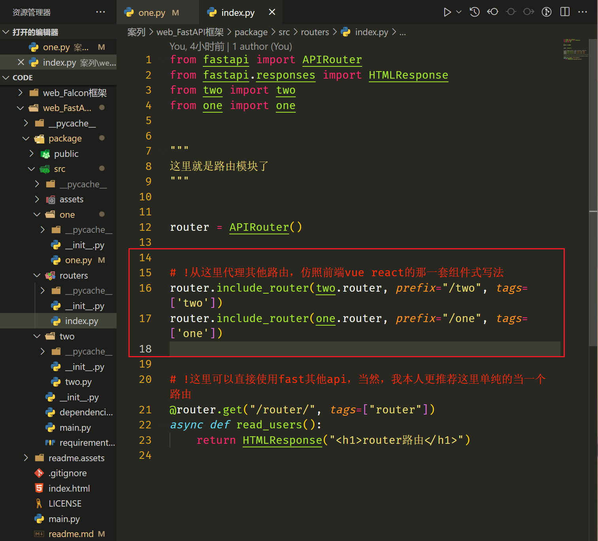
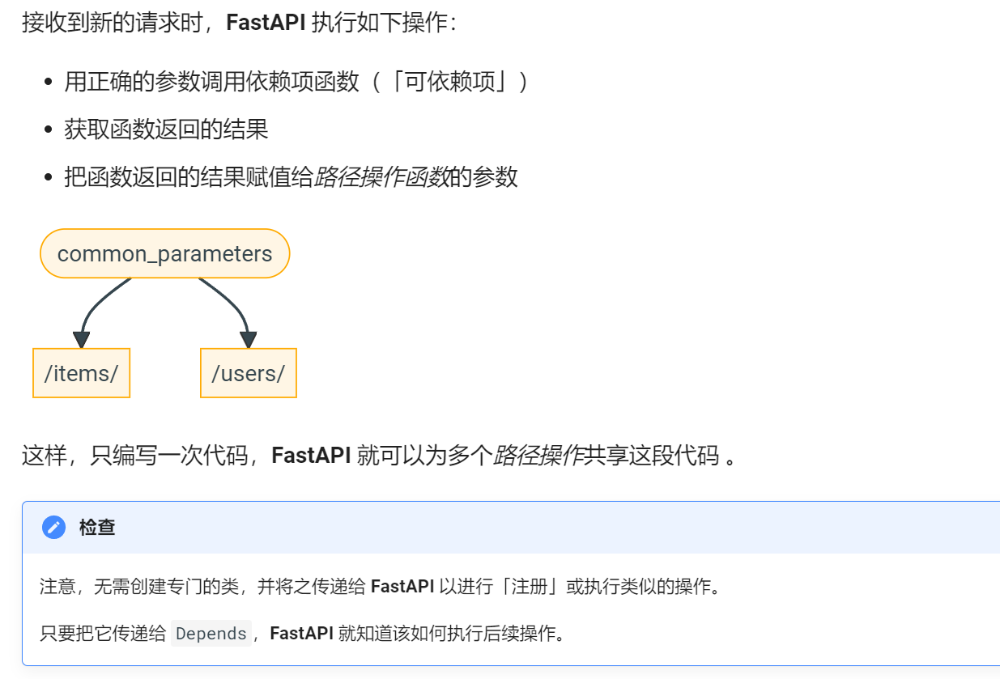
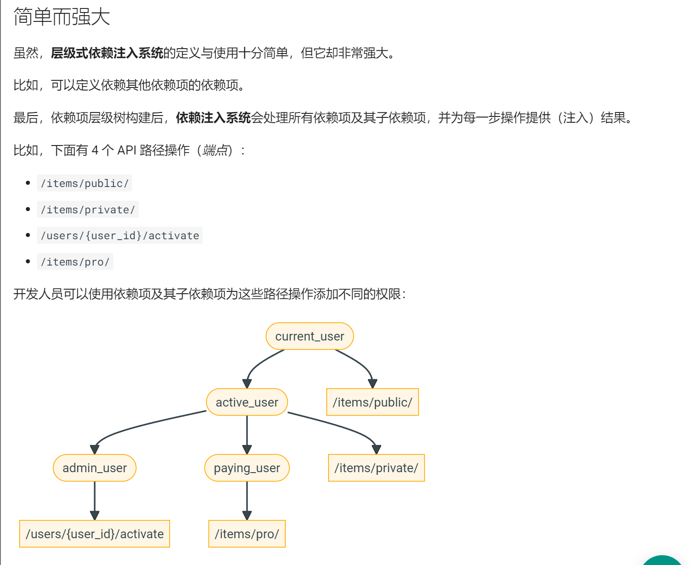
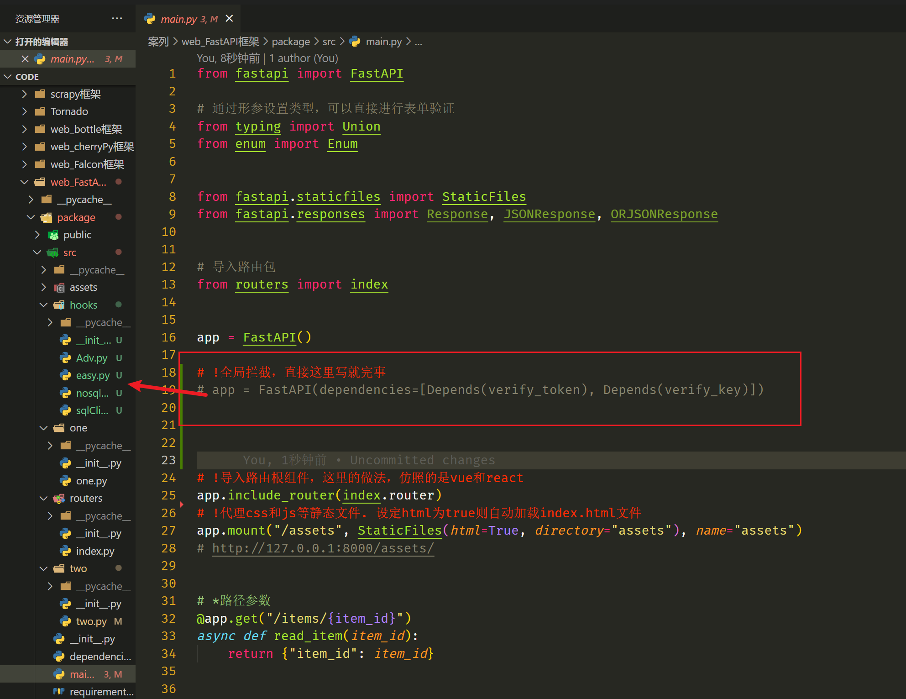
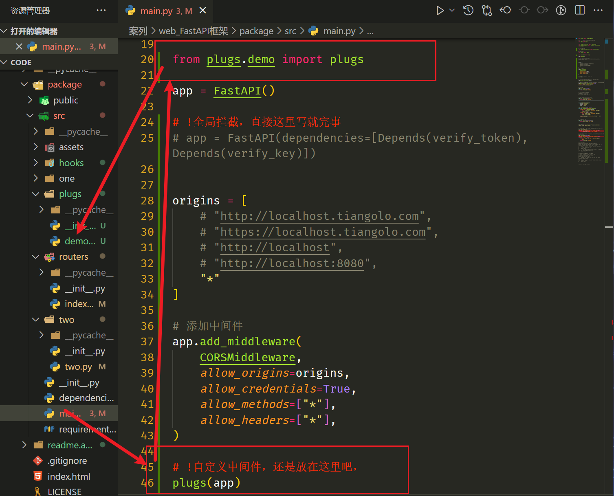
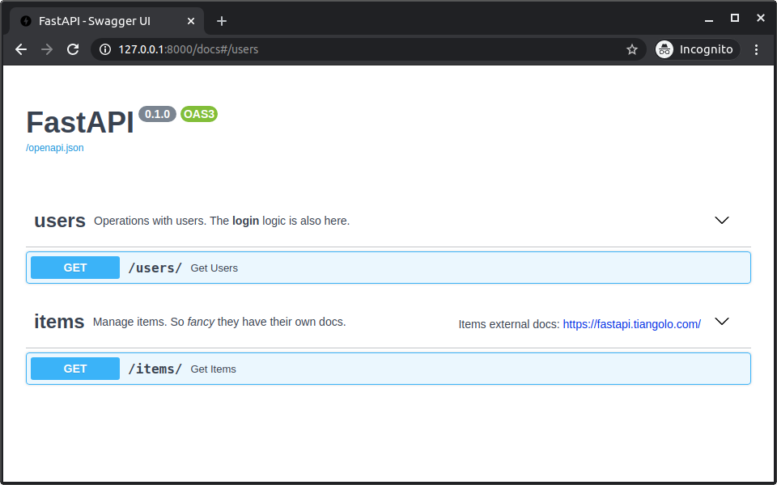
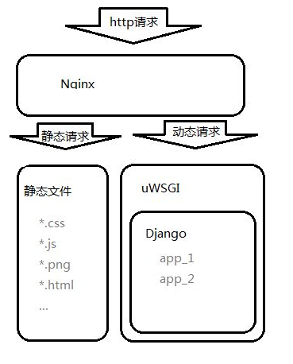

# FastAPI框架学习

## 为什么要选择fastapi框架

典型的MVC框架，FastAPI 是一个用于构建 API 的现代、快速（高性能）的 web 框架，使用 Python 3.6+ 并基于标准的 Python 类型提示。

1.可与 **NodeJS** 和 **Go** 并肩的极高性能web框架。（等我需要用到Rust时，可能会更快，😀）

2.自动生成接口文档。交互式 API 文档以及具探索性 web 界面。因为该框架是基于 OpenAPI，所以有很多可选项，FastAPI 默认自带两个交互式 API 文档。直接生成api文档，发给前端。

http://127.0.0.1:8000/docs

http://127.0.0.1:8000/redoc

类似Flask的写法，但是异步IO，性能得到了极大提高。

## 基本

安装方式：

全功能安装

```
$ pip install "fastapi[all]"
```

生产环境安装，这是体积最小的包了

```
$ pip install fastapi "uvicorn[standard]"
```

简单使用

```
# package/src/main.py

from fastapi import FastAPI

app = FastAPI()


@app.get("/")
async def root():
    return {"message": "Hello World"}

```

命令行，启动网关

```
$ uvicorn main:app --reload
```

 常用REST接口写法。其他method不常用

```
POST：创建数据。
GET：读取数据。
PUT：更新数据。
DELETE：删除数据。
```

### 路径

#### 路径传参

<span style="color: red;">记住/url和/url/是不同的两个路径，虽然请求/url/同样会返回数据，但是会发生临时重定向
`307 Temporary Redirect`
解决这个问题，可以通过异常，拦截，中间件等方法解决。</span>


```
@app.get("/items/{item_id}")
async def read_item(item_id):
    return {"item_id": item_id}
```

2.传参校验

```
# *如果传入不是int，则会返回错误
@app.get("/items2/{item_id}")
async def read_item3(item_id: int):
    return {"item_id": item_id}


# 枚举类型,这里就特别类似ts的接口写法了
class ModelName(str, Enum):
    alexnet = "alexnet"
    resnet = "resnet"
    lenet = "lenet"

@app.get("/models/{model_name}")
async def get_model(model_name: ModelName):
    if model_name is ModelName.alexnet:
        return {"model_name": model_name, "message": "Deep Learning FTW!"}

    if model_name.value == "lenet":
        return {"model_name": model_name, "message": "LeCNN all the images"}

    return {"model_name": model_name, "message": "Have some residuals"}
```

3.路径顺序

```
# !同等路由下，顺序很重要
@app.get("/items2/test")
async def read_item2():
    return {"item_id": 1}


# *如果传入不是int，则会返回错误，进行传参的路由等级更高
@app.get("/items2/{item_id}")
async def read_item3(item_id: int):
    return {"item_id": item_id}
```

4.传递path路径参数

```
@app.get("/files/{file_path:path}")
async def read_file(file_path: str):
    return {"file_path": file_path}
```

#### get传参

1.基础

```
# !这里就是get传参的标准写法, 对应请求写法, http://127.0.0.1:8000/getPara/?skip=0&limit=10
@app.get("/getPara/")
async def read_item(skip: int = 0, limit: int = 10):
    return fake_items_db[skip : skip + limit]
```

2.可选参数Union

```
@app.get("/union/{item_id}")
async def read_item(item_id: str, q: Union[str, None] = None, short: bool = False):
    if q:
        return {"item_id": item_id, "q": q, "short": short}
    return {"item_id": item_id}
```

3.混合写法

```
# ?一种穿插写法
# @app.get("/users/{user_id}/items/{item_id}")
# async def read_user_item(user_id: int, item_id: str, q: Union[str, None] = None, short: bool = False):
#     item = {"item_id": item_id, "owner_id": user_id}
#     if q:
#         item.update({"q": q})
#     if not short:
#         item.update({"description": "This is an amazing item that has a long description"})
#     return item


# ?needy，一个必需的 str 类型参数。
# ?skip，一个默认值为 0 的 int 类型参数。
# ?limit，一个可选的 int 类型参数。
# @app.get("/items/{item_id}")
# async def read_user_item(
#     item_id: str, needy: str, skip: int = 0, limit: Union[int, None] = None
# ):
#     item = {"item_id": item_id, "needy": needy, "skip": skip, "limit": limit}
#     return item
```

### 请求体

服务端获取request对象，验证request中header, body,data等参数的过程.

必须要看表单验证模型

https://pydantic-docs.helpmanual.io/usage/types/

#### post验证模型

```
# src/one/one.py
# !接口写法
class Item(BaseModel):
    name: str
    # !可选属性
    description: Union[str, None] = None
    price: float
    tax: Union[float, None] = None


@router.post("/postAuth/")
async def create_item(item: Item):
    # !我们访问一下对象的所有属性
    print(item)
    itemDict = item.dict()
    print(itemDict)
    return item


# ?这里就是组合式了
# @router.put("/postAuth/{item_id}")
# async def create_item2(item_id: int, item: Item, q: Union[str, None] = None):
#     result = {"item_id": item_id, **item.dict()}
#     if q:
#         result.update({"q": q})
#     return result
```

#### Query模型

https://fastapi.tiangolo.com/zh/tutorial/query-params-str-validations/

常用于post和put

```
from typing import Union

from fastapi import FastAPI, Query

app = FastAPI()


@app.get("/items/")
async def read_items(
    q: Union[str, None] = Query(
        default=None, min_length=3, max_length=50, regex="^fixedquery$"
    )
):
    results = {"items": [{"item_id": "Foo"}, {"item_id": "Bar"}]}
    if q:
        results.update({"q": q})
    return results
```

#### Path模型

使用接口的方式，根据url查询数据。

```
# ! 路径校验,你可以声明与 Query 相同的所有参数，但却是路径形式
# http://127.0.0.1:8000/one/path/123123?item-query=213
@router.get("/path/{item_id}")
async def read_path(
    item_id: int = Path(title="The ID of the item to get", gt=0, le=1000),
    q: Union[str, None] = Query(default=None, alias="item-query"),
):
    results = {"item_id": item_id}
    if q:
        results.update({"q": q})
    return results
```

#### body模型

如果存在类文本格式的数据，我们确实需要body查询。

```
# !Body校验，不管传递啥，都是body类型
@router.put("/putBody/")
async def update_item(importance: str = Body()):
    results = {"importance": importance}
    return results


class Item3(BaseModel):
    name: str


# !body 特殊参数，一旦加入则必须使用嵌套对象
@router.put("/putBody2/{item_id}")
async def update_item2(item_id: int, item: Item3 = Body(embed=True)):
    results = {"item_id": item_id, "item": item}
    return results
```

#### Field模型验证

```
# !Field 具有Query全部的参数，不过引入的Pydantic中的
# ?请记住当你从 fastapi 导入 Query、Path 等对象时，他们实际上是返回特殊类的函数。
class Item4(BaseModel):
    name: str
    description: Union[str, None] = Field(default=None, title="The description of the item", max_length=300)
    price: float = Field(gt=0, description="The price must be greater than zero")
    tax: Union[float, None] = None


@router.put("/items4/{item_id}")
async def update_item3(item_id: int, item: Item4 = Body(embed=True)):
    results = {"item_id": item_id, "item": item}
    return results
```

#### nest嵌套模型+特殊模型

这种特殊的模型，都需要从pydantic和typing中继承。这两个库就是后端数据验证的核心。

```
# !申明具有子类型的嵌套模型
class Image(BaseModel):
    url: HttpUrl
    name: str
    # !引入特殊验证模型
    email: EmailStr
    data: Dict[str, str]
    data2: Tuple[str]
    data3: Set[int]


class TestApi(BaseModel):
    students: List[str] = []
    tags: Union[Set[str], None] = set()
    image: Union[Image, None] = None


@router.post("/testapi/")
async def postTestApi(item: TestApi):
    print(item)
    return item
```

#### docs模型

顺便申明例子。。。

```
# !甚至可以声明例子。。。
class cs(BaseModel):
    name: str
    description: Union[str, None] = None
    price: float
    tax: Union[float, None] = None

    class Config:
        # 举例子区域
        schema_extra = {
            "example": {
                "name": "Foo",
                "description": "A very nice Item",
                "price": 35.4,
                "tax": 3.2,
            }
        }


@router.put("/cs/")
async def update_cs(item: cs):
    results = {"item": item}
    return results
```

#### 额外数据模型

通过以下两个库，应该可以找到大部分数据验证模型了。

https://fastapi.tiangolo.com/zh/tutorial/extra-data-types/

https://pydantic-docs.helpmanual.io/usage/types/

### cookie & headre

你可以像定义 `Query` 参数和 `Path` 参数一样来定义 `Cookie`， headre 参数。

```
# !cookie header 参数，难道只能内部解析？
@router.post("/headre/")
async def readCookie(__cf_bm: Union[str, None] = Cookie(default=None), user_agent: Union[str, None] = Header(default=None)):
    # header参数： convert_underscores=False，可以禁止下划线连字符的自动转换
    print(__cf_bm, "\n", user_agent, "\n")
    return {"cookie": __cf_bm, "user_agent": user_agent}

```

这种方法，有点low啊，非要形参解耦的方式获取参数。


### 响应模型

#### 1.利用模型过滤参数response_model

这里真的缺少了一个sql和nosql client链接器，一般我们从数据库中取出来的数据为：

多组数据： [{},{}]

一组数据：{}，[]

单个数据：value

至于想要具体什么结构的数据，还可以二次处理他们，然后返回给前端。

```
# !利用模型过滤参数
class UserIn(BaseModel):
    username: str
    password: str
    email: EmailStr
    full_name: Union[str, None] = None


class UserOut(BaseModel):
    username: str = "admin"
    email: EmailStr
    full_name: Union[str, None] = None


@router.post("/user/", response_model=UserOut)
async def create_user(user: UserIn) -> Any:
    return user
```

#### 2.忽略响应模型中的默认值

```
# !利用模型过滤参数
class UserIn(BaseModel):
    username: str
    password: str
    email: EmailStr
    full_name: Union[str, None] = None


class UserOut(BaseModel):
    # !可以给响应模型添加默认值
    username: str = "admin"
    email: EmailStr
    full_name: Union[str, None] = None


# 给响应数据端，设置了一个模型
@router.post("/user/", response_model=UserOut)
async def create_user(user: UserIn) -> Any:
    return user

# 这样一来就可以忽略响应模型中的默认值
@router.get("/user/", response_model=UserOut, response_model_exclude_unset=True)
async def get_user(user: UserIn) -> Any:
    return user
```

```
其他忽略方法:
https://pydantic-docs.helpmanual.io/usage/exporting_models/#modeldict 原生方法
response_model_exclude_defaults=True
response_model_exclude_none=True
```

```
高级方法：
from typing import Union

from fastapi import FastAPI
from pydantic import BaseModel

app = FastAPI()


class Item(BaseModel):
    name: str
    description: Union[str, None] = None
    price: float
    tax: float = 10.5


items = {
    "foo": {"name": "Foo", "price": 50.2},
    "bar": {"name": "Bar", "description": "The Bar fighters", "price": 62, "tax": 20.2},
    "baz": {
        "name": "Baz",
        "description": "There goes my baz",
        "price": 50.2,
        "tax": 10.5,
    },
}


@app.get(
    "/items/{item_id}/name",
    response_model=Item,
    # 要导入的对象
    response_model_include={"name", "description"},
)
async def read_item_name(item_id: str):
    return items[item_id]


@app.get("/items/{item_id}/public", response_model=Item, 
# 要忽略的对象
response_model_exclude={"tax"})
async def read_item_public_data(item_id: str):
    return items[item_id]
```

#### 3.响应状态码

```
100 及以上状态码用于「消息」响应。你很少直接使用它们。具有这些状态代码的响应不能带有响应体。
200 及以上状态码用于「成功」响应。这些是你最常使用的。
200 是默认状态代码，它表示一切「正常」。
另一个例子会是 201，「已创建」。它通常在数据库中创建了一条新记录后使用。
一个特殊的例子是 204，「无内容」。此响应在没有内容返回给客户端时使用，因此该响应不能包含响应体。
300 及以上状态码用于「重定向」。具有这些状态码的响应可能有或者可能没有响应体，但 304「未修改」是个例外，该响应不得含有响应体。
400 及以上状态码用于「客户端错误」响应。这些可能是你第二常使用的类型。
一个例子是 404，用于「未找到」响应。
对于来自客户端的一般错误，你可以只使用 400。
500 及以上状态码用于服务器端错误。你几乎永远不会直接使用它们。当你的应用程序代码或服务器中的某些部分出现问题时，它将自动返回这些状态代码之一。
```

```
from fastapi import FastAPI, status

app = FastAPI()


@app.post("/items/", status_code=status.HTTP_201_CREATED)
async def create_item(name: str):
    return {"name": name}
    
@app.post("/items/", status_code=201)
async def create_item(name: str):
    return {"name": name}
```

### 表单数据

很少见到表单数据form传递了，除了上下传文件这样的操作。

安装表单解析工具

```
pip install python-multipart
```

```
表单数据的「媒体类型」编码一般为 application/x-www-form-urlencoded。
但包含文件的表单编码为 multipart/form-data。
```

```
# !表单信息传递
@router.post("/login/")
async def login(username: str = Form(), password: str = Form()):
    return {"username": username}
```

#### 文件上传

https://fastapi.tiangolo.com/zh/tutorial/request-files/

##### 基础文件上传

```
# !上传文件接口，bytes会一直占用内存，
@router.post("/files/")
async def create_file(file: bytes = File()):
    return {"file_size": len(file)}


# !推荐使用，方法更多，占用内存少
@router.post("/uploadfile/")
async def create_upload_file(file: UploadFile):
    contents = await file.read()
    print(contents)
    return {"filename": file.filename}
```

##### 可选文件上传

```
from fastapi import FastAPI, File, UploadFile

app = FastAPI()


@app.post("/files/")
async def create_file(file: bytes | None = File(default=None)):
    if not file:
        return {"message": "No file sent"}
    else:
        return {"file_size": len(file)}


@app.post("/uploadfile/")
async def create_upload_file(file: UploadFile | None = None):
    if not file:
        return {"message": "No upload file sent"}
    else:
        return {"filename": file.filename}
```

##### 多文件上传

```
from fastapi import FastAPI, File, UploadFile
from fastapi.responses import HTMLResponse

app = FastAPI()


@app.post("/files/")
async def create_files(files: list[bytes] = File()):
    return {"file_sizes": [len(file) for file in files]}


@app.post("/uploadfiles/")
async def create_upload_files(files: list[UploadFile]):
    return {"filenames": [file.filename for file in files]}


@app.get("/")
async def main():
    content = """
<body>
<form action="/files/" enctype="multipart/form-data" method="post">
<input name="files" type="file" multiple>
<input type="submit">
</form>
<form action="/uploadfiles/" enctype="multipart/form-data" method="post">
<input name="files" type="file" multiple>
<input type="submit">
</form>
</body>
    """
    return HTMLResponse(content=content)
```

#### 文件上传+表单数据

```
from fastapi import FastAPI, File, Form, UploadFile

app = FastAPI()


@app.post("/files/")
async def create_file(
    file: bytes = File(), fileb: UploadFile = File(), token: str = Form()
):
    return {
        "file_size": len(file),
        "token": token,
        "fileb_content_type": fileb.content_type,
    }
```

依然是推荐UploadFile接收表单文件

### 响应异常

基本响应异常

```
# !处理异常HTTPException
@router.get("/err/{item_id}")
async def check_err(item_id: str):
    if item_id != "index":
        raise HTTPException(status_code=404, detail="err", headers={"X-Error": "???"})
    return "be ok"
```

#### 自定义响应异常

如果你觉得不够用的话，还可以自定义。这个太扯了。

https://fastapi.tiangolo.com/zh/tutorial/handling-errors/

#### 基础异常

```
from fastapi import FastAPI, HTTPException

app = FastAPI()

items = {"foo": "The Foo Wrestlers"}


@app.get("/items/{item_id}")
async def read_item(item_id: str):
    if item_id not in items:
        raise HTTPException(status_code=404, detail="Item not found")
    return {"item": items[item_id]}
```

#### 自定义异常

```
from fastapi import FastAPI, Request
from fastapi.responses import JSONResponse


class UnicornException(Exception):
    def __init__(self, name: str):
        self.name = name


app = FastAPI()


@app.exception_handler(UnicornException)
async def unicorn_exception_handler(request: Request, exc: UnicornException):
    return JSONResponse(
        status_code=418,
        content={"message": f"Oops! {exc.name} did something. There goes a rainbow..."},
    )


@app.get("/unicorns/{name}")
async def read_unicorn(name: str):
    if name == "yolo":
        raise UnicornException(name=name)
    return {"unicorn_name": name}
```


#### SPA单页面

404响应必须重定向到根路径上，不然单页SPA应用就无法路由。hash模式除外。我们需要覆盖fastapi的默认404异常，并重定向到/root根路径。

```
# !解决SPA单页面问题，重定向到根路径
@app.exception_handler(exc_class_or_status_code=404)
async def validation_exception_handler(request, exc):
    return RedirectResponse("/")


@app.get("/")
async def main():
    return {"main": "ok"}
```

### 路径操作配置

标签配置：如果不配置标签，则http://127.0.0.1:8000/docs# 生成的API文档会出现问题我，从router 到 url 等等。

#### 1.url标签

```
from typing import Set, Union

from fastapi import FastAPI
from pydantic import BaseModel

app = FastAPI()


class Item(BaseModel):
    name: str
    description: Union[str, None] = None
    price: float
    tax: Union[float, None] = None
    tags: Set[str] = set()


@app.post("/items/", response_model=Item, tags=["items"])
async def create_item(item: Item):
    return item


@app.get("/items/", tags=["items"])
async def read_items():
    return [{"name": "Foo", "price": 42}]


@app.get("/users/", tags=["users"])
async def read_users():
    return [{"username": "johndoe"}]
```

#### 2.router标签



#### 3.额外参数

基本描述

```
from typing import Set, Union

from fastapi import FastAPI
from pydantic import BaseModel

app = FastAPI()


class Item(BaseModel):
    name: str
    description: Union[str, None] = None
    price: float
    tax: Union[float, None] = None
    tags: Set[str] = set()


@app.post(
    "/items/",
    response_model=Item,
    summary="Create an item",
    description="Create an item with all the information, name, description, price, tax and a set of unique tags",
)
async def create_item(item: Item):
    return item
```

请求端描述

    """
    Create an item with all the information:
    
    - **name**: each item must have a name
    - **description**: a long description
    - **price**: required
    - **tax**: if the item doesn't have tax, you can omit this
    - **tags**: a set of unique tag strings for this item
    """

```
from typing import Set, Union

from fastapi import FastAPI
from pydantic import BaseModel

app = FastAPI()


class Item(BaseModel):
    name: str
    description: Union[str, None] = None
    price: float
    tax: Union[float, None] = None
    tags: Set[str] = set()


@app.post("/items/", response_model=Item, summary="Create an item")
async def create_item(item: Item):
    """
    Create an item with all the information:

    - **name**: each item must have a name
    - **description**: a long description
    - **price**: required
    - **tax**: if the item doesn't have tax, you can omit this
    - **tags**: a set of unique tag strings for this item
    """
    return item
```

响应端描述

response_description="The created item",

```
from typing import Set, Union

from fastapi import FastAPI
from pydantic import BaseModel

app = FastAPI()


class Item(BaseModel):
    name: str
    description: Union[str, None] = None
    price: float
    tax: Union[float, None] = None
    tags: Set[str] = set()


@app.post(
    "/items/",
    response_model=Item,
    summary="Create an item",
    response_description="The created item",
)
async def create_item(item: Item):
    return item
```

弃用路径

```
from fastapi import FastAPI

app = FastAPI()


@app.get("/items/", tags=["items"])
async def read_items():
    return [{"name": "Foo", "price": 42}]


@app.get("/users/", tags=["users"])
async def read_users():
    return [{"username": "johndoe"}]


@app.get("/elements/", tags=["items"], deprecated=True)
async def read_elements():
    return [{"item_id": "Foo"}]
```

### json兼容编码器

其实有很多更快的json序列化库，可以去看看。

```
from datetime import datetime

from fastapi import FastAPI
from fastapi.encoders import jsonable_encoder
from pydantic import BaseModel

fake_db = {}


class Item(BaseModel):
    title: str
    timestamp: datetime
    description: str | None = None


app = FastAPI()


@app.put("/items/{id}")
def update_item(id: str, item: Item):
    json_compatible_item_data = jsonable_encoder(item)
    fake_db[id] = json_compatible_item_data
```

### 小技巧

https://fastapi.tiangolo.com/zh/tutorial/body-updates/

一套数据更新技巧。尤其是在使用nosql数据库时。除了put更新数据，还可以使用`PATCH`来更新数据.

## 依赖项

有种前端hoocks的感觉，但是功能更强大，复用所有逻辑，可以用来路由拦截，鉴权，数据库链接等。



普通钩子

from fastapi import Depends 就可以在请求到来前操作参数。

```
from typing import Union

from fastapi import Depends, FastAPI

app = FastAPI()


async def common_parameters(
    q: Union[str, None] = None, skip: int = 0, limit: int = 100
):
    return {"q": q, "skip": skip, "limit": limit}


@app.get("/items/")
async def read_items(commons: dict = Depends(common_parameters)):
    return commons


@app.get("/users/")
async def read_users(commons: dict = Depends(common_parameters)):
    return commons
```



钩子之间可以互相嵌套。。。

遵从先后顺序，最里层的最先被验证。

```
from typing import Union

from fastapi import Cookie, Depends, FastAPI

app = FastAPI()


def query_extractor(q: Union[str, None] = None):
    return q


def query_or_cookie_extractor(
    q: str = Depends(query_extractor),
    last_query: Union[str, None] = Cookie(default=None),
):
    if not q:
        return last_query
    return q


@app.get("/items/")
async def read_query(query_or_default: str = Depends(query_or_cookie_extractor)):
    return {"q_or_cookie": query_or_default}
```

### 拦截器

没有参数返回，只是做一个鉴权。

路由拦截器

```
from fastapi import Depends, FastAPI, Header, HTTPException

app = FastAPI()


async def verify_token(x_token: str = Header()):
    if x_token != "fake-super-secret-token":
        raise HTTPException(status_code=400, detail="X-Token header invalid")


async def verify_key(x_key: str = Header()):
    if x_key != "fake-super-secret-key":
        raise HTTPException(status_code=400, detail="X-Key header invalid")
    return x_key


@app.get("/items/", dependencies=[Depends(verify_token), Depends(verify_key)])
async def read_items():
    return [{"item": "Foo"}, {"item": "Bar"}]
```

全局拦截器

在main.py上写就行。



## 安全验证

OpenAPI（以前称为 Swagger）是用于构建 API 的开放规范（现已成为 Linux Foundation 的一部分）。

**FastAPI** 基于 **OpenAPI**。

这就是使多个自动交互式文档界面，代码生成等成为可能的原因。

OpenAPI 有一种定义多个安全「方案」的方法。

通过使用它们，你可以利用所有这些基于标准的工具，包括这些交互式文档系统。

OpenAPI 定义了以下安全方案：

- **apiKey**：一个特定于应用程序的密钥，可以来自：
  - 查询参数。
  - 请求头。
  - cookie。

- http：标准的 HTTP 身份认证系统，包括：
  - `bearer`: 一个值为 `Bearer` 加令牌字符串的 `Authorization` 请求头。这是从 OAuth2 继承的。
  - HTTP Basic 认证方式。
  - HTTP Digest，等等。

- oauth2：所有的 OAuth2 处理安全性的方式（称为「流程」）。 *以下几种流程适合构建 OAuth 2.0 身份认证的提供者（例如 Google，Facebook，Twitter，GitHub 等）： * implicit * clientCredentials * authorizationCode
  - 但是有一个特定的「流程」可以完美地用于直接在同一应用程序中处理身份认证：
    - `password`：接下来的几章将介绍它的示例。

- openIdConnect：提供了一种定义如何自动发现 OAuth2 身份认证数据的方法。
  - 此自动发现机制是 OpenID Connect 规范中定义的内容。

https://fastapi.tiangolo.com/zh/tutorial/security/first-steps/

根据不同需求使用不同的验证加密方式。这里我就不多介绍了。

```
from fastapi import Depends, FastAPI
from fastapi.security import OAuth2PasswordBearer

app = FastAPI()

# 生成验证hoock
oauth2_scheme = OAuth2PasswordBearer(tokenUrl="token")


@app.get("/items/")
async def read_items(token: str = Depends(oauth2_scheme)):
	# 数据库存储token临时令牌，然后当你需要跳转其他路由时，可以使用hoock拦截器验证权限
    return {"token": token}
```

通常是需要结合表单验证模型一起使用。快速提取路径传参，get传参，post传参等等。

需要跟前端约定好！当然，还是由后端负责安全，不然会出很多问题。

毕竟永远不要信任前端的传来的任何数据。


## 中间件

自定义中间件

```
import time

from fastapi import FastAPI, Request

app = FastAPI()


@app.middleware("http")
async def add_process_time_header(request: Request, call_next):
    # 这里就是我自定义一个中间件
    start_time = time.time()
    response = await call_next(request)
    process_time = time.time() - start_time
    response.headers["X-Process-Time"] = str(process_time)
    return response
```

最佳位置




其他三方ASGI中间件

https://fastapi.tiangolo.com/zh/advanced/middleware/

### 强制证书

HTTPSRedirectMiddleware 强制所有传入请求必须是`https`或`wss`。

相反，任何传入的请求`http`或`ws`将被重定向到安全方案。


### 防盗链

TrustedHostMiddleware 强制所有传入请求都具有正确设置的`Host`标头，以防止 HTTP 主机标头攻击。


### 标准流式处理文件上下传

GZipMiddleware


### CORS（跨域资源共享）

https://fastapi.tiangolo.com/zh/tutorial/cors/

```
from fastapi import FastAPI
from fastapi.middleware.cors import CORSMiddleware

app = FastAPI()

origins = [
    "http://localhost.tiangolo.com",
    "https://localhost.tiangolo.com",
    "http://localhost",
    "http://localhost:8080",
]

app.add_middleware(
    CORSMiddleware,
    allow_origins=origins,
    allow_credentials=True,
    allow_methods=["*"],
    allow_headers=["*"],
)


@app.get("/")
async def main():
    return {"message": "Hello World"}
```

支持以下参数：

- `allow_origins` - 一个允许跨域请求的源列表。例如 `['https://example.org', 'https://www.example.org']`。你可以使用 `['*']` 允许任何源。
- `allow_origin_regex` - 一个正则表达式字符串，匹配的源允许跨域请求。例如 `'https://.*\.example\.org'`。
- `allow_methods` - 一个允许跨域请求的 HTTP 方法列表。默认为 `['GET']`。你可以使用 `['*']` 来允许所有标准方法。
- `allow_headers` - 一个允许跨域请求的 HTTP 请求头列表。默认为 `[]`。你可以使用 `['*']` 允许所有的请求头。`Accept`、`Accept-Language`、`Content-Language` 以及 `Content-Type` 请求头总是允许 CORS 请求。
- `allow_credentials` - 指示跨域请求支持 cookies。默认是 `False`。另外，允许凭证时 `allow_origins` 不能设定为 `['*']`，必须指定源。
- `expose_headers` - 指示可以被浏览器访问的响应头。默认为 `[]`。
- `max_age` - 设定浏览器缓存 CORS 响应的最长时间，单位是秒。默认为 `600`。

中间件响应两种特定类型的 HTTP 请求……

## 数据库客户端

### 1.sql客户端

https://fastapi.tiangolo.com/zh/tutorial/sql-databases/

官方依然是推荐SQLAlchemy，当然你使用其他的库也是可以的。记得要节约资源就好。

### 2.nosql客户端

redis, mongodb等等，都有自己的三方库可以使用，记得每次使用完毕，都要回收线程。

### 3.其他计算

深度学习AI，消息中间件，任务中间件等等。都可以集成起来。


### 4.使用自带后台异步任务中间件

如果简单的话，就用自带的。难的话，就用celery。

https://fastapi.tiangolo.com/zh/tutorial/background-tasks/

```
from fastapi import BackgroundTasks, Depends, FastAPI

app = FastAPI()


def write_log(message: str):
    with open("log.txt", mode="a") as log:
        log.write(message)


def get_query(background_tasks: BackgroundTasks, q: str | None = None):
    if q:
        message = f"found query: {q}\n"
        background_tasks.add_task(write_log, message)
    return q


@app.post("/send-notification/{email}")
async def send_notification(
    email: str, background_tasks: BackgroundTasks, q: str = Depends(get_query)
):
    message = f"message to {email}\n"
    background_tasks.add_task(write_log, message)
    # 可以继续添加任务
     background_tasks.add_task(write_log, message)
    return {"message": "Message sent"}
```


## 文档元数据

让你的docs更好看？

https://fastapi.tiangolo.com/zh/tutorial/metadata/

文档可以直接本地存储成HTML下来，不涉及到本地资源。

```
from fastapi import FastAPI

description = """
ChimichangApp API helps you do awesome stuff. 🚀

## Items

You can **read items**.

## Users

You will be able to:

* **Create users** (_not implemented_).
* **Read users** (_not implemented_).
"""

app = FastAPI(
    title="ChimichangApp",
    description=description,
    version="0.0.1",
    terms_of_service="http://example.com/terms/",
    contact={
        "name": "Deadpoolio the Amazing",
        "url": "http://x-force.example.com/contact/",
        "email": "dp@x-force.example.com",
    },
    license_info={
        "name": "Apache 2.0",
        "url": "https://www.apache.org/licenses/LICENSE-2.0.html",
    },
)


@app.get("/items/")
async def read_items():
    return [{"name": "Katana"}]
```


标签元数据

```
from fastapi import FastAPI

tags_metadata = [
    {
        "name": "users",
        "description": "Operations with users. The **login** logic is also here.",
    },
    {
        "name": "items",
        "description": "Manage items. So _fancy_ they have their own docs.",
        "externalDocs": {
            "description": "Items external docs",
            "url": "https://fastapi.tiangolo.com/",
        },
    },
]

app = FastAPI(openapi_tags=tags_metadata)


@app.get("/users/", tags=["users"])
async def get_users():
    return [{"name": "Harry"}, {"name": "Ron"}]


@app.get("/items/", tags=["items"])
async def get_items():
    return [{"name": "wand"}, {"name": "flying broom"}]
```



文档URL

```
from fastapi import FastAPI

app = FastAPI(openapi_url="/api/v1/openapi.json")


@app.get("/items/")
async def read_items():
    return [{"name": "Foo"}]
```

```
from fastapi import FastAPI

app = FastAPI(docs_url="/documentation", redoc_url=None)


@app.get("/items/")
async def read_items():
    return [{"name": "Foo"}]
```

## 静态文件代理

理论上不需要，只需要配置好nginx，然后托管静态文件即可。

https://fastapi.tiangolo.com/zh/tutorial/static-files/

还需要SSR服务器渲染的话，那就自代理静态文件即可。

```
from fastapi import FastAPI
from fastapi.staticfiles import StaticFiles

app = FastAPI()

# ！直接app.mount
# 子路径，静态文件夹，名字等其他参数
app.mount("/static", StaticFiles(directory="static"), name="static")
```


## 测试

一般不需要测试，除非甲方有要求。

https://fastapi.tiangolo.com/zh/tutorial/testing/

```
from fastapi import FastAPI
from fastapi.testclient import TestClient

app = FastAPI()


@app.get("/")
async def read_main():
    return {"msg": "Hello World"}


client = TestClient(app)


def test_read_main():
    response = client.get("/")
    assert response.status_code == 200
    assert response.json() == {"msg": "Hello World"}
```


## 启动服务

官网：https://www.uvicorn.org/		

设定指定serve运行ip和port

```
$ uvicorn main:app --host 0.0.0.0 --port 80
```

使用默认IP和端口，开启热重载

http://127.0.0.1:8000

```
$ uvicorn main:app --reload
```

其他指令，可以查询uvicorn官网。

```
$ uvicorn --help
```

网关和代理，可以是同一个事物，也可以不是。。。



网关服务：在操作系统上使用ip并创建对应的开放接口。通常是 LAN or localhost。

代理服务：端口转发，静态文件分发，限流，限速，负载均衡等功能。

**★具体生产部署，请看[部署](#部署) **


### 调试一般放在这里

https://fastapi.tiangolo.com/zh/tutorial/debugging/

需要配置主入口

```
import uvicorn
from fastapi import FastAPI

app = FastAPI()


@app.get("/")
def root():
    a = "a"
    b = "b" + a
    return {"hello world": b}


if __name__ == "__main__":
    uvicorn.run(app, host="0.0.0.0", port=8000)
```


## 进阶

### 大型项目构成

这里我们以一个项目package 结构为基准。我这里就直接使用前端的基本结构了

https://fastapi.tiangolo.com/tutorial/bigger-applications/#include-an-apirouter-with-a-prefix-tags-responses-and-dependencies

```
.
├── package              # "app" is a Python package
│   ├── __init__.py      # this file makes "app" a "Python package"
│   ├── main.py          # "main" module, e.g. import app.main
│   ├── dependencies.py  # "dependencies" module, e.g. import app.dependencies
│   └── routers          # "routers" is a "Python subpackage"
│   │   ├── __init__.py  # makes "routers" a "Python subpackage"
│   │   ├── items.py     # "items" submodule, e.g. import app.routers.items
│   │   └── users.py     # "users" submodule, e.g. import app.routers.users
│   └── internal         # "internal" is a "Python subpackage"
│       ├── __init__.py  # makes "internal" a "Python subpackage"
│       └── admin.py     # "admin" submodule, e.g. import app.internal.admin
```

### 路径高级操作

不太需要，只是openapi的细节设置。

https://fastapi.tiangolo.com/zh/advanced/path-operation-advanced-configuration/

### 自定义响应

#### JSONResponse

如果你想要返回主要状态码之外的状态码，你可以通过直接返回一个 `Response` 来实现，比如 `JSONResponse`，然后直接设置额外的状态码。

例如，假设你想有一个 *路径操作* 能够更新条目，并且更新成功时返回 200 「成功」 的 HTTP 状态码。

但是你也希望它能够接受新的条目。并且当这些条目不存在时，会自动创建并返回 201 「创建」的 HTTP 状态码。

要实现它，导入 `JSONResponse`，然后在其中直接返回你的内容，并将 `status_code` 设置为为你要的值。

```
from typing import Union

from fastapi import Body, FastAPI, status
from fastapi.responses import JSONResponse

app = FastAPI()

items = {"foo": {"name": "Fighters", "size": 6}, "bar": {"name": "Tenders", "size": 3}}


@app.put("/items/{item_id}")
async def upsert_item(
    item_id: str,
    name: Union[str, None] = Body(default=None),
    size: Union[int, None] = Body(default=None),
):
    if item_id in items:
        item = items[item_id]
        item["name"] = name
        item["size"] = size
        return item
    else:
        item = {"name": name, "size": size}
        items[item_id] = item
        return JSONResponse(status_code=status.HTTP_201_CREATED, content=item)
```

#### Response

自定义响应

```
from fastapi import FastAPI, Response

app = FastAPI()


@app.get("/legacy/")
def get_legacy_data():
    data = """<?xml version="1.0"?>
    <shampoo>
    <Header>
        Apply shampoo here.
    </Header>
    <Body>
        You'll have to use soap here.
    </Body>
    </shampoo>
    """
    return Response(content=data, media_type="application/xml")
```

#### ORJSONResponse

高性能json序列化器

```
pip install --upgrade orjson
```

```
from fastapi import FastAPI
from fastapi.responses import ORJSONResponse

app = FastAPI()


@app.get("/items/", response_class=ORJSONResponse)
async def read_items():
    return ORJSONResponse([{"item_id": "Foo"}])
```

#### HTMLResponse

```
from fastapi import FastAPI
from fastapi.responses import HTMLResponse

app = FastAPI()


@app.get("/items/", response_class=HTMLResponse)
async def read_items():
    return """
    <html>
        <head>
            <title>Some HTML in here</title>
        </head>
        <body>
            <h1>Look ma! HTML!</h1>
        </body>
    </html>
    """
```

```
from fastapi import FastAPI
from fastapi.responses import HTMLResponse

app = FastAPI()


def generate_html_response():
    html_content = """
    <html>
        <head>
            <title>Some HTML in here</title>
        </head>
        <body>
            <h1>Look ma! HTML!</h1>
        </body>
    </html>
    """
    return HTMLResponse(content=html_content, status_code=200)


@app.get("/items/", response_class=HTMLResponse)
async def read_items():
    return generate_html_response()
```

#### PlainTextResponse

纯文本响应

```
from fastapi import FastAPI
from fastapi.responses import PlainTextResponse

app = FastAPI()


@app.get("/", response_class=PlainTextResponse)
async def main():
    return "Hello World"
```

#### RedirectResponse

重定向

```
from fastapi import FastAPI
from fastapi.responses import RedirectResponse

app = FastAPI()


@app.get("/typer")
async def redirect_typer():
    return RedirectResponse("https://typer.tiangolo.com")
```

#### 流媒体，流式传输响应

```
from fastapi import FastAPI
from fastapi.responses import StreamingResponse

app = FastAPI()


async def fake_video_streamer():
    for i in range(10):
        yield b"some fake video bytes"


@app.get("/")
async def main():
    return StreamingResponse(fake_video_streamer())
```

#### 文件响应

```
from fastapi import FastAPI
from fastapi.responses import StreamingResponse

some_file_path = "large-video-file.mp4"
app = FastAPI()


@app.get("/")
def main():
    def iterfile():  # (1)
        with open(some_file_path, mode="rb") as file_like:  # (2)
            yield from file_like  # (3)

    return StreamingResponse(iterfile(), media_type="video/mp4")
```

```
from fastapi import FastAPI
from fastapi.responses import FileResponse

some_file_path = "large-video-file.mp4"
app = FastAPI()


@app.get("/")
async def main():
    return FileResponse(some_file_path)
```

### 附加响应

**如果您从FastAPI**开始，您可能不需要这个。

https://fastapi.tiangolo.com/zh/advanced/additional-responses/


### 响应cookies

一般响应中不需要cookies，只有request常用。推荐token鉴权。

```
from fastapi import FastAPI
from fastapi.responses import JSONResponse

app = FastAPI()


@app.post("/cookie/")
def create_cookie():
    content = {"message": "Come to the dark side, we have cookies"}
    response = JSONResponse(content=content)
    response.set_cookie(key="fakesession", value="fake-cookie-session-value")
    return response
```

### 高级响应头

这个一般是请求头需要，响应头不太需要。

```
from fastapi import FastAPI, Response

app = FastAPI()


@app.get("/headers-and-object/")
def get_headers(response: Response):
    response.headers["X-Cat-Dog"] = "alone in the world"
    return {"message": "Hello World"}
```

### 修改响应状态码

这个常用，要记一下。

```
from fastapi import FastAPI, Response, status

app = FastAPI()

tasks = {"foo": "Listen to the Bar Fighters"}

# 默认响应状态码
@app.put("/get-or-create-task/{task_id}", status_code=200)
def get_or_create_task(task_id: str, response: Response):
    if task_id not in tasks:
        # 临时修改状态码
        tasks[task_id] = "This didn't exist before"
        response.status_code = status.HTTP_201_CREATED
    return tasks[task_id]
```


### 高级依赖

高级钩子hoocks。

https://fastapi.tiangolo.com/zh/advanced/advanced-dependencies/

就是高级class对象操作。不常用


### ☆Request对象

直接获取全部请求对象，除了headers，cookie，localstore，还有客户端的IP/Port/dns/client type等

这个常用来做黑名单。

```
from fastapi import FastAPI, Request

app = FastAPI()


@app.get("/items/{item_id}")
def read_root(item_id: str, request: Request):
    client_host = request.client.host
    return {"client_host": client_host, "item_id": item_id}
```

### ☆高级中间件

https://fastapi.tiangolo.com/zh/advanced/middleware/

可以使用全部ASGI中间件，需要找一找。

https://www.starlette.io/middleware/

#### session中间件

SessionMiddleware 可能会在SSR中需要。

### 使用数据类

不好用，表单验证过后，直接可以入库。

```
from dataclasses import dataclass
from typing import Union

from fastapi import FastAPI


@dataclass
class Item:
    name: str
    price: float
    description: Union[str, None] = None
    tax: Union[float, None] = None


app = FastAPI()


@app.post("/items/")
async def create_item(item: Item):
    return item
```

### 推荐使用异步数据库

aiomysql

[asyncpg](https://github.com/MagicStack/asyncpg)

aiopg

Motor

redis


### 挂在子应用

https://fastapi.tiangolo.com/zh/advanced/sub-applications/

非子路由，容易和子路由混淆。性能下降。。。。

```
from fastapi import FastAPI

app = FastAPI()


@app.get("/app")
def read_main():
    return {"message": "Hello World from main app"}


subapi = FastAPI()


@subapi.get("/sub")
def read_sub():
    return {"message": "Hello World from sub API"}


app.mount("/subapi", subapi)
```

### ★websocket

流媒体传输

```
pip install websockets
```

重点来了，这里就涉及到多媒体技术了，我们一般选择的比较成熟的HLS视频协议，对直播和点播都有效果。

websocket：专用于browser浏览器的ws套接字，流式链接。
socket：服务器端只需要socket 然后开放 open port 即可。

websocket 仅仅是应用层的TCP协议。

如果真想实现UDP协议传输，本身存在很多问题，需要使用服务端配合。
webRTC协议 https://webrtc.org/getting-started/firebase-rtc-codelab?hl=zh-cn

#### 消息传输
数据传输：流式数据链接，可以做聊天app，其中TCP/UDP都是可以用的。

```
  
# !有bug存在，/ws/ 和 /ws 是不同的表示

@router.websocket("/ws")

async def websocket1(websocket: WebSocket):

    await websocket.accept()

    while True:

        # 持续接收参数

        data = await websocket.receive_text()

        print("接收数据:", data)

        await websocket.send_text(f"{data}")

  
  

class ConnectionManager:

    def __init__(self):

        # websocket连接池

        self.active_connections: List[WebSocket] = []

  

    async def connect(self, websocket: WebSocket, token):

        # 等待链接，由于存在token是以子协议的方式传递。我们也得走子协议

        await websocket.accept(subprotocol=token)

        # 将联入的客户端加入列表

        self.active_connections.append(websocket)

  

    def disconnect(self, websocket: WebSocket):

        # 删除客户端

        self.active_connections.remove(websocket)

  

    async def send_personal_message(self, message: str, websocket: WebSocket):

        # 单一客户端发送

        await websocket.send_text(message)

  

    async def broadcast(self, message: str):

        # 这里就是广播了，给所有客户端发送

        for connection in self.active_connections:

            await connection.send_text(message)

  
  

manager = ConnectionManager()

  
  

# 加入钩子，验证token是否正确.

async def get_cookie_or_token(websocket: WebSocket):

    # 通过子协议头获取token

    token = websocket.headers.get("sec-websocket-protocol")

  

    if token != "123":

        raise WebSocketException(code=status.WS_1008_POLICY_VIOLATION)

  

    return token

  
  

@router.websocket("/ws3/{client_id}")

async def websocket_endpoint(websocket: WebSocket, client_id: int, token: str = Depends(get_cookie_or_token)):

    # 开始接收链接

    await manager.connect(websocket, token)

    try:

        while True:

            # 接收文本数据

            data = await websocket.receive_text()

            # 单数据

            await manager.send_personal_message(f"You wrote: {data}", websocket)

            await manager.broadcast(f"Client #{client_id} says: {data}")

    # 这里的异常才是关键

    except WebSocketDisconnect:

        manager.disconnect(websocket)

        # 谁出问题，谁挂断

        await manager.broadcast(f"Client #{client_id} left the chat")
```

#### 鉴权

1.send中发送消息时，携带token
`let  ws = new WebSocket("ws://" + url + "/webSocketServer"); ws.onopen=() = >{ ws.send({token, message, data})}
`
2.url传参token
`let ws = new WebSocket("ws://" + url+ "/?token=123");`

3.基于协议头添加token
记得前后端的子协议保持一致，不然会出问题。
`let ws = new WebSocket("ws://" + url+ "/webSocketServer",[token]);`

#### ★多媒体传输
多媒体传输：主要是对视频or音频等文件切片后，流式传输，加快前端响应速度。
HLS基于HTTP协议实现，传输内容包括两部分，一是M3U8描述文件，二是TS媒体文件。

播放器自定义 video.js，这个要二次开发才能用。

HLS主流切片协议分发 HLS.js

无需flash播放器 flv.js

视频转换器 FFmpeg，这里要交给后端任务队列去处理。

现成的一款弹幕播放器 https://github.com/oyuyue/nplayer


### app生命周期

https://fastapi.tiangolo.com/zh/advanced/events/

app启动前，触发的事件。

```
from fastapi import FastAPI

app = FastAPI()

items = {}


@app.on_event("startup")
async def startup_event():
    items["foo"] = {"name": "Fighters"}
    items["bar"] = {"name": "Tenders"}


@app.get("/items/{item_id}")
async def read_items(item_id: str):
    return items[item_id]
```

app结束后的事件

```
from fastapi import FastAPI

app = FastAPI()


@app.on_event("shutdown")
def shutdown_event():
    with open("log.txt", mode="a") as log:
        log.write("Application shutdown")


@app.get("/items/")
async def read_items():
    return [{"name": "Foo"}]
```


### ★graphql

新一代动态接口。

https://fastapi.tiangolo.com/zh/advanced/graphql/

```
import strawberry
from fastapi import FastAPI
from strawberry.asgi import GraphQL


@strawberry.type
class User:
    name: str
    age: int


@strawberry.type
class Query:
    @strawberry.field
    def user(self) -> User:
        return User(name="Patrick", age=100)


schema = strawberry.Schema(query=Query)


graphql_app = GraphQL(schema)

app = FastAPI()
app.add_route("/graphql", graphql_app)
app.add_websocket_route("/graphql", graphql_app)
```

### HTML模板

主要指代jinja2

https://fastapi.tiangolo.com/zh/advanced/templates/

```
pip install jinja2
```

```
from fastapi import FastAPI, Request
from fastapi.responses import HTMLResponse
from fastapi.staticfiles import StaticFiles
from fastapi.templating import Jinja2Templates

app = FastAPI()

app.mount("/static", StaticFiles(directory="static"), name="static")


templates = Jinja2Templates(directory="templates")


@app.get("/items/{id}", response_class=HTMLResponse)
async def read_item(request: Request, id: str):
    return templates.TemplateResponse("item.html", {"request": request, "id": id})
```

### 自定义请求和子路由

https://fastapi.tiangolo.com/zh/advanced/custom-request-and-route/

这个不常用啊。


### 高级安全

加盐加密，时间校验，ip校验，验证码也行。

http基本身份验证，不常见了。多用于代理服务器。

https://fastapi.tiangolo.com/zh/advanced/security/http-basic-auth/


## 其他

### 并发和并行

https://fastapi.tiangolo.com/zh/async/

多线程，多进程 = 并行

异步，协程 = 并发

二者可以相互叠加，提高serve的性能。

### 部署

目前因为微服务的成熟，更好的做法是cloud容器化，然后kubernetes，实现单容器单进程，然后使用弹性云网关进行反向代理。

#### ★记得关闭文档功能

记得看这里

https://fastapi.tiangolo.com/zh/advanced/behind-a-proxy/

### 设置环境变量Env

https://fastapi.tiangolo.com/zh/advanced/settings/

需要的时候写一个就行，况且不太需要。。。

一般来说走配置文件，比如现在推荐的config.toml，config.json等，


#### 单服务器部署

https://gunicorn.org/

Gunicorn是uvicorn官方推荐的资源分配管理工具，可以帮助你分配进程，**同时这允许您动态地增加或减少工作进程的数量，从容地重启工作进程，或者在不停机的情况下执行服务器升级。**

（**Uvicorn**本身也有这个多进程启动的功能，但不全面。。。）

https://fastapi.tiangolo.com/zh/deployment/server-workers/


#### 多服务器部署

##### ★首要推荐**Kubernetes**

要多复杂由多复杂， 建议容器化，然后集群管理，使用弹性动态网关代理。

##### 免费云服务器

https://www.deta.sh/


### HTTPS证书

**ssl证书可以给nginx配置，也可以直接给serve配置，都行。**

一般一台服务器（单个ip）只能配置一张https证书。但TLS协议的扩展SNI，允许单ip对应多个证书，有兴趣可以了解一下，等于是ip复用了。


